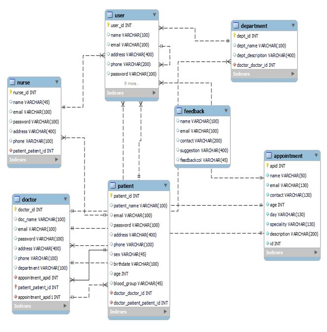
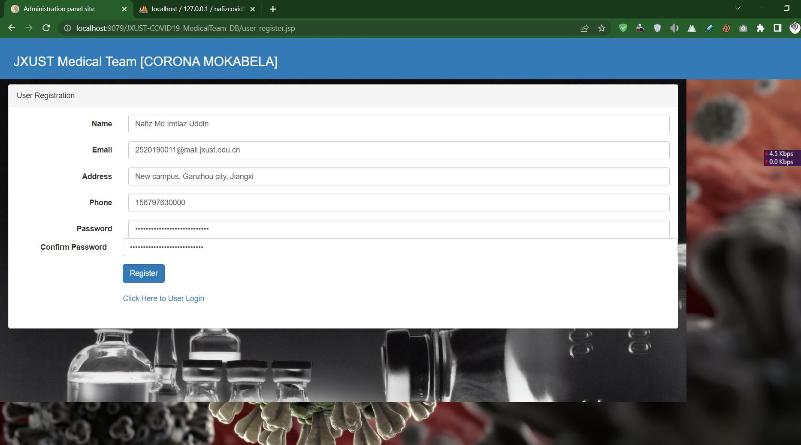
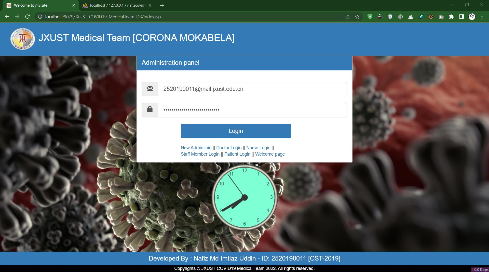
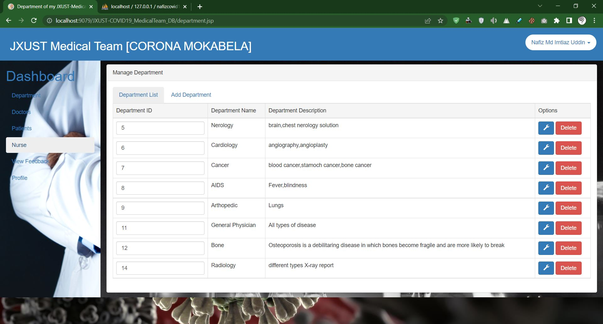
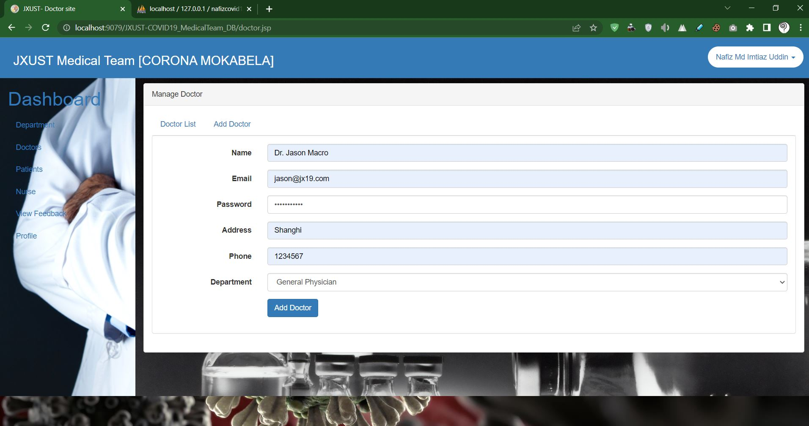
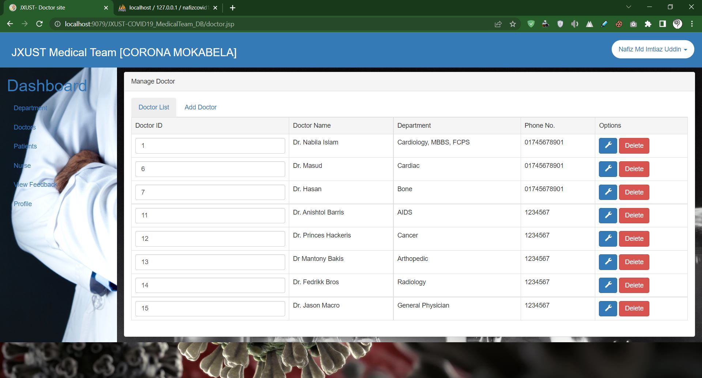
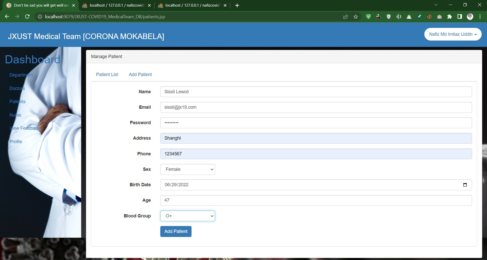
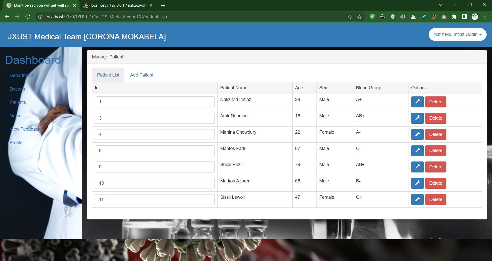
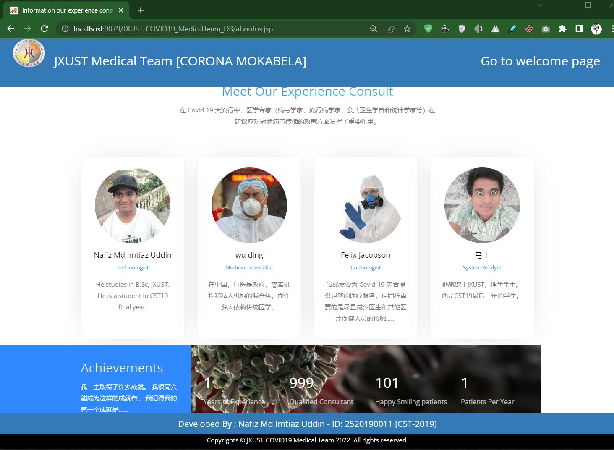
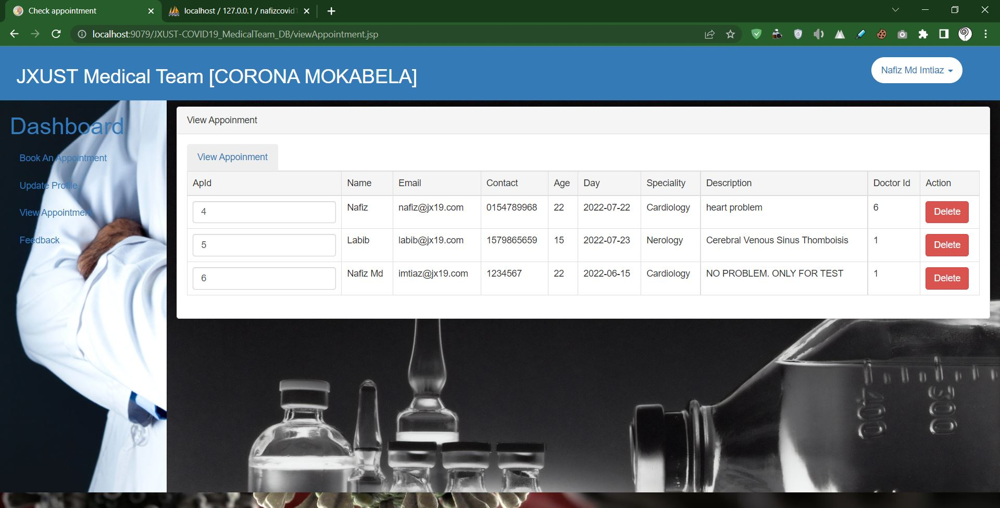

_In this project, patients need specialist doctors at different times during the pandemic (COVID 19). So, this project has been created as a special team arrangement considering all the patients. Also, here Servlet, JSP, JavaScript, jQuery, Bootstrap, CSS, and MySQL methods have been used. The name of the IDE tool used here is Apache NetBeans 13. This web application has administrative access, doctor access, nurse access, and patient access. Each user will be able to save his ID and password through the database system. Usually, when running this web application, the welcome page will come up first. Also included are feedback, department, and appointment systems. A total of nine Java packages have been created in this project. So, if we want code to run in a JSP page then we want JavaScript. We can use java to write code that will be run on a server that will output custom JSP as responses to requests from a web browser._

## ERD 

## [See more flowchart...](https://www.slideshare.net/secret/CKe3VYRVbDJZsG)

### Here is inclued some screenshots:

## [Click for more screenshots & details](https://www.slideshare.net/secret/CKe3VYRVbDJZsG)